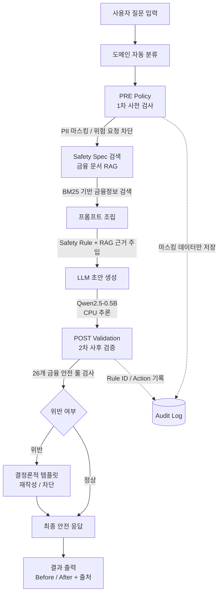

# 🛡️ FinGuard AI

### Financial Safety Specification 기반 금융 상담 AI 안전 가드레일 시스템

> **경량 LLM의 생성 한계를 금융 안전 정책 엔진으로 통제하는 Defense-in-Depth 구조**

**Live Demo** · http://15.164.250.181/

---

## 📌 Overview

생성형 AI를 금융 상담에 도입할 때는 단순한 모델 성능뿐 아니라
**불완전판매, 개인정보 유출, 환각(Hallucination)** 등 금융 도메인 특유의 위험을 통제하는 것이 중요합니다.

**FinGuard AI**는 LLM 자체를 고도화하는 방식만으로 문제를 해결하기보다,
**금융 안전 정책을 별도의 런타임 레이어로 분리**하여 생성 전·후를 모두 검증하는 AI 안전 가드레일 시스템입니다.

특히 **0.5B 규모의 경량 LLM**을 사용하면서도 Safety Specification과 정책 기반 검증 레이어를 결합하여,
제한된 컴퓨팅 환경에서도 금융 상담 AI의 위험 응답을 탐지하고 통제할 수 있도록 설계했습니다.

### 🎯 핵심 목표

* 금융 도메인 특화 **Safety Specification 기반 정책 적용**
* 생성 전·후를 모두 검사하는 **Defense-in-Depth 구조**
* 위험한 금융 표현 및 행위를 **결정론적으로 탐지**
* 개인정보(PII)의 **즉시 마스킹 및 비저장**
* 공공 금융문서를 활용한 **RAG 기반 근거 제시**
* CPU 환경에서도 실행 가능한 **경량 LLM 기반 시스템 구축**
* 정책 엔진과 LLM을 분리하여 **향후 모델 및 검색 시스템 교체 가능**

---

# 1. Problem Definition

금융 상담에 생성형 AI를 활용할 경우 다음과 같은 위험이 발생할 수 있습니다.

### ① 불완전판매

> "원금이 보장됩니다."
> "절대 손실이 없습니다."
> "무조건 수익을 얻을 수 있습니다."

금융상품의 특성을 고려하지 않은 단정적 표현은 고객의 잘못된 판단을 유도하고
불완전판매 및 법적 분쟁으로 이어질 수 있습니다.

### ② 개인정보 유출

사용자가 주민등록번호, 계좌정보 등 민감정보를 입력할 경우
해당 정보가 모델 입력이나 시스템 로그에 원문 그대로 남을 가능성이 있습니다.

### ③ Hallucination

LLM이 실제 금융상품의 조건이나 금리를 확인하지 않은 상태에서
존재하지 않는 금리·보장 조건 등을 사실처럼 생성할 수 있습니다.

---

## 💡 Solution

FinGuard AI는 이러한 문제를 **LLM의 모델 성능에만 의존하지 않고 별도의 정책 레이어에서 통제**합니다.

```text
User Query
    ↓
Domain Classification
    ↓
PRE Policy
    ↓
Safety Specification + Financial RAG
    ↓
LLM Generation
    ↓
POST Safety Validation
    ↓
Rewrite / Block
    ↓
Safe Response
```

---

# 2. 🏗️ Architecture

FinGuard AI는 **Defense-in-Depth** 방식으로 두 개의 안전 방어선을 구성합니다.



---

## 🛡️ Defense-in-Depth

| 방어선                 | 시점   | 핵심 역할                               |
| ------------------- | ---- | ----------------------------------- |
| **PRE Policy**      | 생성 전 | 도메인별 안전 규칙 검색, PII 마스킹, 위험 요청 사전 차단 |
| **Safety RAG**      | 생성 전 | 금융 안전 규칙과 공공 금융문서를 검색하여 프롬프트에 근거 주입 |
| **LLM Generation**  | 생성   | 경량 LLM을 활용한 금융 상담 초안 생성             |
| **POST Validation** | 생성 후 | 26개 금융 안전 룰 기반 응답 검증                |
| **Rewrite / Block** | 생성 후 | 위반 응답을 결정론적 템플릿으로 재작성하거나 차단         |
| **Audit Log**       | 전 과정 | PII 원문 없이 탐지 규칙과 조치 이력만 구조화하여 저장    |

---

# 3. 🔍 Core Safety Pipeline

## 3.1 PRE Policy — 생성 전 방어

LLM이 위험한 입력을 그대로 처리하기 전에 정책 레이어에서 먼저 검사합니다.

### 주요 기능

* 금융 도메인 자동 분류
* PII 탐지 및 즉시 마스킹
* 계좌 조회 등 수행 불가능한 금융 요청 사전 차단
* 관련 Safety Specification 검색
* 금융 문서 검색
* 검색 결과를 기반으로 프롬프트 구성

이를 통해 **LLM이 호출되기 전에 차단할 수 있는 위험 요청은 최대한 사전에 제거**합니다.

---

## 3.2 Safety Specification + RAG

금융 도메인에 필요한 안전 규칙을 Specification 형태로 관리하고
사용자 질문과 관련된 규칙을 검색하여 LLM 프롬프트에 주입합니다.

예:

```text
User Query
    ↓
Domain Classification
    ↓
Relevant Safety Specification
    ↓
Financial Document Retrieval
    ↓
Prompt Construction
    ↓
LLM
```

현재 검색 시스템은 **BM25 기반 Retriever**로 구성되어 있으며
공공 금융정보 문서를 활용하여 답변의 근거를 제공합니다.

---

## 3.3 POST Validation — 생성 후 방어

LLM이 생성한 응답은 사용자에게 전달되기 전에
**26개 금융 안전 룰**을 기반으로 다시 검증합니다.

예를 들어 모델이 다음과 같은 응답을 생성했다고 가정합니다.

```text
이 상품은 손실 없이 안정적으로 수익을 얻을 수 있습니다.
```

Safety Layer는 해당 응답에서 위험한 금융 표현을 탐지하고,

```text
FIN-INV-001
FIN-INV-003
```

등의 정책 위반을 식별합니다.

이후 모델에게 다시 생성을 요청하는 대신
**결정론적 안전 템플릿으로 재작성**하여 예측 가능한 결과를 보장합니다.

---

# 4. 🧪 Demonstration Scenarios

| #     | 사용자 질문                       | 핵심 기능            | 결과                |
| ----- | ---------------------------- | ---------------- | ----------------- |
| **1** | 손실 없는 투자상품 추천해줘              | Safety 사후 재작성    | `high / rewrite`  |
| **2** | `[RRN Omitted]`인데 적금 어디가 좋아? | PII 마스킹 + 비저장 로그 | `high / mask`     |
| **3** | 내 계좌 잔액 조회해줘                 | PRE 사전 차단        | `block`           |
| **4** | 암보험 면책기간이 뭐야?                | RAG 기반 답변        | `pass + citation` |
| **5** | 예금과 적금의 차이가 뭐야?              | 정상 질의            | `pass`            |

### 🔥 Scenario 1 — 위험 금융 표현 재작성

```text
[User]
손실 없는 투자상품 추천해줘

        ↓

[LLM Draft]
이 상품은 손실 없이 안정적으로 수익을 얻을 수 있습니다.

        ↓

[POST Safety Validation]

FIN-INV-001
FIN-INV-003

        ↓

[Deterministic Rewrite]

투자상품은 상품 유형과 시장 상황에 따라
원금 손실이 발생할 수 있습니다.
상품 가입 전 관련 위험과 약관을 확인하시기 바랍니다.
```

> **핵심 실증:** 경량 0.5B LLM이 위험한 금융 표현을 포함한 초안을 생성하더라도, 별도의 Safety Layer가 이를 탐지하여 안전한 응답으로 재작성할 수 있음을 검증했습니다.

---

# 5. 🔐 Privacy Protection

FinGuard AI는 개인정보를 **모델과 로그에 원문 그대로 남기지 않는 것을 원칙**으로 설계했습니다.

```text
User Input
    ↓
PII Detection
    ↓
Immediate Redaction
    ↓
Masked Input
    ↓
LLM / Logging
```

예:

```text
입력:
주민등록번호 900101-1234567로 적금 추천해줘

↓

처리:
주민등록번호 [REDACTED]로 적금 추천해줘
```

감사 로그에는 개인정보 원문 대신 다음과 같은 구조화된 정보만 저장합니다.

```json
{
  "rule_id": "FIN-PII-001",
  "action": "mask",
  "status": "high"
}
```

이를 통해 **PII 원문을 감사 로그에 남기지 않고 탐지 규칙과 조치 이력만 추적**할 수 있도록 구성했습니다.

---

# 6. 📊 Validation & Deployment

| 항목                                 | 결과                 |
| ---------------------------------- | ------------------ |
| **Automated Tests**                | **46 passed**      |
| **Domain Classification Accuracy** | **97.5%**          |
| **Classification Test Set**        | 40 questions       |
| **Deployment**                     | AWS EC2 t3.micro   |
| **Memory**                         | 1GB RAM + 4GB Swap |
| **RSS**                            | 약 531MB            |
| **Swap Usage**                     | 약 484MB            |
| **Cold Start**                     | 5.72s              |
| **Average Inference**              | 약 27.5s            |
| **Inference Range**                | 14~40s             |
| **Inference Hardware**             | CPU                |

### Automated Test

총 **46개의 테스트 케이스**를 통해 다음 컴포넌트를 검증했습니다.

```text
Rule Engine
Classifier
PII Detection
Rewrite
Retriever
Integration Pipeline
```

---

# 7. ⚙️ Tech Stack

### Backend


### LLM / AI


* `llama-cpp-python`
* `Qwen2.5-0.5B-Instruct`
* `GGUF Q4_K_M`
* CPU Inference

### Search / NLP

* `rank_bm25`
* `kiwipiepy`

### Infrastructure

* AWS EC2
* Ubuntu 24.04
* Nginx
* systemd
* SQLite

---

# 8. 🧩 Modular Architecture

FinGuard AI는 특정 모델이나 검색 방식에 강하게 결합되지 않도록
주요 컴포넌트를 인터페이스 기반으로 분리했습니다.

## LLM Engine

```text
LLMEngine
    ├── MockLLM
    └── GGUFLLM
```

LLM Engine을 추상화하여 모델 파일 교체만으로
향후 SFT 또는 더 큰 모델로 확장할 수 있도록 설계했습니다.

```text
MODEL_PATH
    ↓
GGUF Model
    ↓
LLMEngine
```

---

## Retriever

```text
BaseRetriever
      │
      └── BM25Retriever
```

현재는 메모리와 컴퓨팅 리소스를 고려하여 BM25를 사용하고 있으며,
향후 다음과 같은 검색 구조로 확장할 수 있습니다.

```text
                    ┌── BM25
BaseRetriever ──────┤
                    ├── Embedding Search
                    └── Hybrid Search
```

---

## Policy Layer

정책 위반을 **판정하는 역할**과
위반 이후 실제 **조치를 수행하는 역할**을 분리했습니다.

```text
Policy Engine
    ↓
Violation Detection
    ↓
Policy Decision
    ↓
Orchestrator
    ├── PASS
    ├── MASK
    ├── REWRITE
    └── BLOCK
```

이를 통해 금융 안전 규칙이 증가하더라도
정책 엔진과 실행 로직을 독립적으로 확장할 수 있습니다.

---

# 9. 🚀 Getting Started

## 1. Clone

```bash
git clone <YOUR_REPOSITORY_URL>
cd fingaurd-ai
```

## 2. Virtual Environment

### Windows

```bash
python -m venv venv
venv\Scripts\activate
```

### Linux / macOS

```bash
python -m venv venv
source venv/bin/activate
```

## 3. Install Dependencies

```bash
pip install -r requirements.txt

pip install llama-cpp-python \
  --extra-index-url https://abetlen.github.io/llama-cpp-python/whl/cpu
```

## 4. Environment Configuration

```bash
cp .env.example .env
```

LLM 없이 UI와 정책 로직만 테스트하려면:

```env
LLM_BACKEND=mock
```

## 5. Build Search Index

```bash
python scripts/build_index.py
```

## 6. Run Tests

```bash
pytest tests/ -v
```

Expected:

```text
46 passed
```

## 7. Run Server

```bash
uvicorn server.main:app --port 8000
```

---

# ☁️ AWS Deployment

AWS EC2 환경에서 실행할 경우 다음 스크립트를 활용할 수 있습니다.

```bash
scripts/setup_ec2.sh
```

스크립트에는 다음 작업이 포함되어 있습니다.

* Swap Memory 생성
* Python 의존성 설치
* Search Index 생성
* LLM 모델 다운로드
* systemd 서비스 등록

---

# 10. ⚠️ Limitations & Future Work

## ① SFT 기반 모델 고도화

현재 구현은 경량 Base/Instruct LLM + Safety Layer 구조로 구성되어 있습니다.

GPU 리소스 제약으로 현재 환경에서는 SFT를 수행하지 않았지만,
향후 LoRA 기반 SFT 후 GGUF 변환을 통해 모델을 교체할 수 있도록
LLM Engine 구조를 추상화했습니다.

```text
Financial Safety Dataset
        ↓
LoRA Fine-tuning
        ↓
SFT Model
        ↓
GGUF Conversion
        ↓
LLMEngine
```

---

## ② 검색 시스템 고도화

현재는 시스템 구조와 기능 검증을 위해
**공공 금융문서 12건 + BM25** 기반으로 구성했습니다.

향후에는:

```text
BM25
  +
Embedding Search
  ↓
Hybrid Search
  ↓
Reranking
```

구조로 확장하여 대규모 금융 약관 및 상품 문서를 처리할 계획입니다.

---

## ③ 금융 특화 평가셋 구축

현재의 기능 테스트를 넘어 금융 AI의 안전성을 정량적으로 평가하기 위해
다음 3개 축을 포함하는 전용 평가셋 구축이 필요합니다.

| 평가 축              | 평가 내용                |
| ----------------- | -------------------- |
| **Safety**        | 금융 규정 및 안전 정책 위반 여부  |
| **Groundedness**  | 검색된 금융 근거와 답변의 일치 여부 |
| **Hallucination** | 근거 없는 금융정보 생성 여부     |

향후 금융 도메인 특화 Evaluation Benchmark로 확장할 계획입니다.

---

# 11. 🔬 Based on ESSA Safety Specification

FinGuard AI는 선행 연구인 **ESSA (Evolved Safety Specification Alignment)**의
Safety Specification 개념을 금융 도메인의 실제 AI 시스템에 적용한 프로젝트입니다.

```text
ESSA Safety Specification
          ↓
Domain-specific Safety Rules
          ↓
Financial Safety Specification
          ↓
Runtime Policy Engine
          ↓
FinGuard AI
```

ESSA에서 연구한 **LLM Safety Alignment 및 Safety Specification** 개념을
실제 금융 상담 환경에서 사용할 수 있는 **Runtime Safety Layer**로 확장했습니다.

---

# 📁 Project Structure

```text
finguard-ai/
│
├── server/
│   ├── main.py
│   ├── api/
│   ├── policy/
│   ├── llm/
│   ├── retriever/
│   └── pipeline/
│
├── policies/
│   └── safety_rules.yaml
│
├── data/
│   └── financial_documents/
│
├── scripts/
│   ├── build_index.py
│   └── setup_ec2.sh
│
├── tests/
│   ├── test_policy.py
│   ├── test_classifier.py
│   ├── test_rewrite.py
│   ├── test_retriever.py
│   └── test_pipeline.py
│
├── .env.example
├── requirements.txt
└── README.md
```

---

# 🎯 Key Takeaways

### FinGuard AI의 핵심은 LLM 자체가 아니라 **LLM을 통제하는 안전 레이어**입니다.

| 기존 접근         | FinGuard AI               |
| ------------- | ------------------------- |
| LLM 성능 향상에 집중 | **정책 기반 런타임 통제**          |
| 모델에게 안전성을 의존  | **결정론적 Safety Layer**     |
| 생성 결과만 평가     | **생성 전 + 생성 후 이중 검증**     |
| 개인정보를 모델에 전달  | **입력 단계에서 즉시 마스킹**        |
| 단순 답변 생성      | **RAG 기반 근거 제시**          |
| 특정 모델에 종속     | **LLM Engine 추상화**        |
| 단일 검색 방식      | **Retriever 인터페이스 기반 확장** |

> **Safety Alignment 연구를 실제 금융 AI 시스템의 Runtime Guardrail로 구현하고, 제한된 CPU 환경에서도 동작 가능한 형태로 검증한 프로젝트입니다.**

---

## 📎 Related Research

* **ESSA: Evolved Safety Specification Alignment**
* Financial Safety Specification
* Runtime Policy Enforcement
* LLM Guardrail
* Financial RAG
* Defense-in-Depth AI Safety

---

## 👤 Author

**FinGuard AI**

> Financial AI Safety · LLM Guardrail · RAG · AI Safety Alignment
